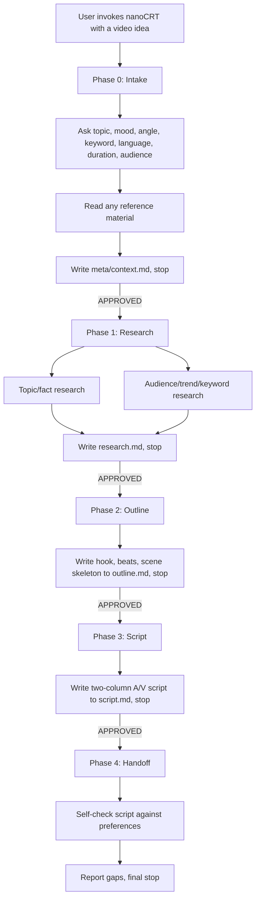

# PRD: nanoCRT

nanoCRT = **nano Content Research Tool**.

> Written by nanoPRD Phase 1. Source of truth for requirements.
>
> Architecture decisions live in `architecture.md`. The Phase 0 record — the idea
> verbatim, references read, research findings, and the answers as given — lives in
> `meta/context.md`. Do not restate either here.
>
> This document analyses that record. If a sentence would read identically in
> `meta/context.md`, cite it instead of copying it.

## 1. Problem

A solo YouTuber making long-form explainers spends hours per video on research and
scripting — work done by hand, differently every time, with no repeatable process
(the Q1 answer is in `meta/context.md`). The cost is not the writing itself; it is
that the writing has no upstream discipline. The user picks an idea on instinct,
researches haphazardly, and writes a script whose structure is whatever felt right
that day.

Fixing it means: preferences are captured *before* research, research is sharpened
by those preferences, and the script emerges from a fixed structure. Then the time
spent shrinks because the path is known, and the script is shootable because the
format is fixed. The user is the only stakeholder — there is no team, no client
sign-off, no deadline pressure beyond their own upload cadence.

## 2. User

The user is a solo creator, so every feature must be usable by one person in one
session, with no collaboration, no accounts, and no admin surface. They are
non-technical about video *production* (they shoot alone, no crew), but technical
enough to run an agent skill in Claude Code or OpenCode. Tolerance for complexity
is low: the skill must ask questions in plain language and hand back files, not
make them manage a pipeline.

Their environment is the agent's working directory — the skill writes files to
their project folder, not to a web app. Frequency of use is per-video (weekly at
most). This means the skill can be thorough and multi-phase; speed is not the
primary constraint, *not having to think* is.

## 3. Differentiation

nanoCRT is **different from both comparable families**, not better than either:

> nanoCRT is the only agent skill that chains audience/trend/keyword research
> into a word-for-word two-column A/V script with shot list, and writes the whole
> thing to your project folder — where research-only tools (vidIQ, TubeBuddy) stop
> at ideas, and script-only tools (Boords, StudioBinder, Commodo, Avey) skip
> research entirely and are login-walled SaaS.

The position is "a different kind of thing," not "the same thing, cheaper": vidIQ
and TubeBuddy cannot produce a script without abandoning their analytics product;
Boords and StudioBinder cannot do research without abandoning their editor product.
Neither can follow the user into their own repo. That is the space nanoCRT owns.

## 4. Core features

| Feature | Why it is core | Serves Phase 0 core? |
|---|---|---|
| Preference-gated intake (topic, mood, angle, keyword, language, duration, audience) | The user's Q3 answer made this the whole point: preferences captured before research make the research sharp | Yes |
| Research phase sharpened by preferences (topic facts + audience/trend/keyword) | This is the "research" half of the name; the gap no competitor fills | Yes |
| Two-column A/V script with word-for-word narration and per-shot visuals | The shootable deliverable; the Q5 criterion depends on it | Yes |

Everything else is base.

## 5. Base features

- Phase 0 — intake asks preference questions, reads any reference material the user points at, records answers verbatim to `meta/context.md`.
- Phase 1 — research writes findings to `research.md`, split into topic-facts and audience/trend/keyword sections.
- Phase 2 — outline writes the script skeleton (hook, beats, scene list) to `outline.md`.
- Phase 3 — script writes the two-column A/V script to `script.md`, one row per shot, narration word-for-word.
- Phase 4 — handoff self-checks the script against the Phase 0 preferences and reports gaps.
- Approval gate between every phase (checkpoint block + wait for `APPROVED`).
- Portability: six spec frontmatter fields only; installs via `.claude-plugin/` and `install.sh` for Claude Code + OpenCode.
- Project scaffolding: creates the working folder (`<project>_crt/` or similar) and its `meta/` directory.
- Language selection asked at intake; script written in the chosen language.

## 6. User flow

## 7. Non-functional requirements

| Requirement | Target | Measured by |
|---|---|---|
| Triggers on intent, not syntax | Skill loads when user says "buat script video", "research konten", "naskah video", or similar | Fresh-session trigger test against 2–3 realistic prompts (see `skill_repo.md` Step 7) |
| Skill frontmatter is spec-only | Only `name`, `description`, `license`, `compatibility`, `metadata`, `allowed-tools` | `claude plugin validate ./skills` passes |
| Repo installs in both tools | `install.sh` links every skill; OpenCode reads `~/.claude/skills` | Run `./install.sh` then verify the symlink resolves to a dir with `SKILL.md` |
| Portability (no tool-specific syntax) | Zero Claude Code-only frontmatter keys or body syntax | Structure CI job (folder/name match + six fields + no forbidden syntax) |
| Script output is a valid two-column A/V doc | Every row has a visual column and an audio column; narration is complete | Human check: `script.md` renders as a table with both columns populated |
| Self-contained repo | No `../` cross-skill references; single skills dir | `claude plugin validate .` passes |

## 8. Success criteria

| Criterion | Threshold | Measured from |
|---|---|---|
| Shootable script with minimal edits | User hands one idea + preferences and gets a script they can shoot from with ≤ 5 manual edits | Post-run check: user reports edit count (binary ≤ 5) |

The Q5 answer as phrased is in `meta/context.md`. This is the same criterion made
countable: an edit is any change the user must make to the narration or the shot
list before shooting, and success is five or fewer.

## 9. Out of scope

Phase 0 deferrals are recorded in `meta/context.md` (SEO metadata, storyboard
images, collaboration, Shorts/TikTok adaptation, runtime-calculator UI). Nothing
additional was deferred in Phase 1.

## 10. Scope challenges

| Feature requested | Underlying need | Alternative offered | Outcome |
|---|---|---|---|
| "keyword" as an intake preference | The research must be sharp, not generic | Keywords are an intake field that *narrows* research, not a separate SEO-title feature | Accepted — keyword narrows research; SEO title generation stays deferred |
| Runtime/timing calculation | The user must know the video is the right length | Word-count ÷ 150 wpm as a computed line in `script.md`, not a UI calculator | Accepted — computed field, no UI |
