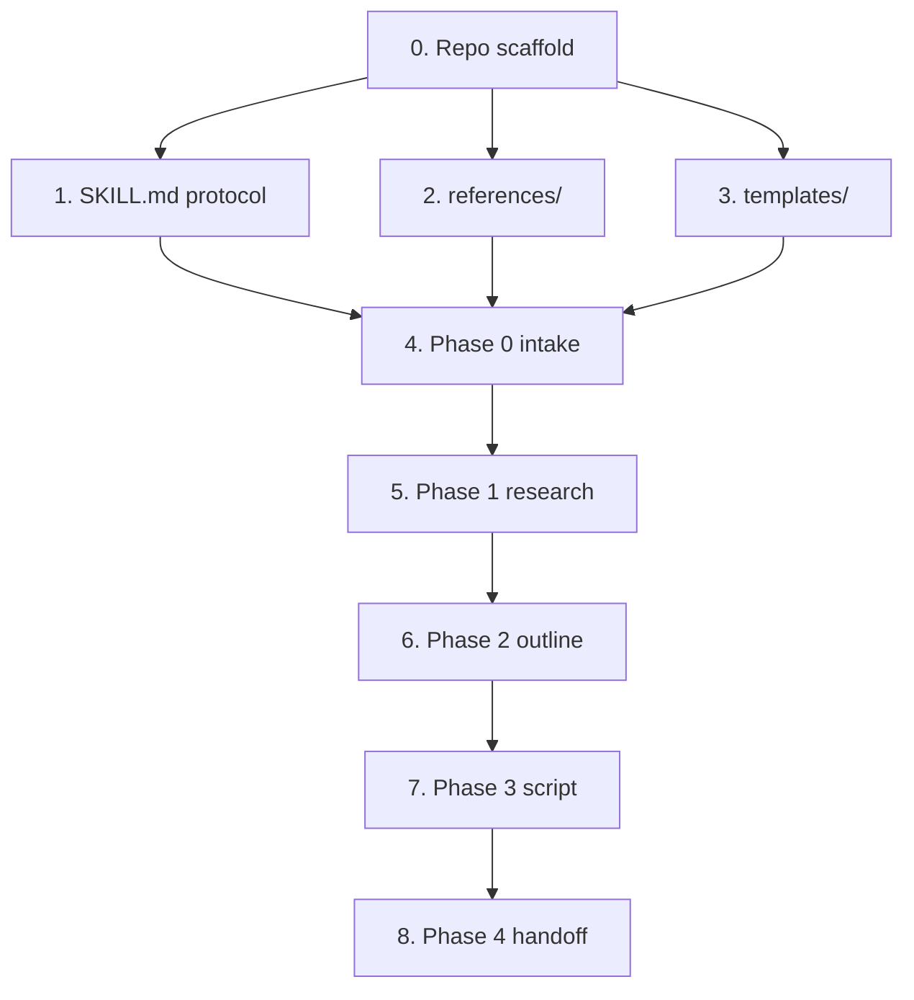

# Architecture: nanoCRT

> Written by nanoPRD Phase 2. Source of truth for stack, data model, and structure.
> Nanotasks reference this file rather than restating it.

nanoCRT is an **agent skill**, not a running application. Its "stack" is the
portable Agent Skills format; its "data model" is the set of deliverable documents
each phase writes to disk; its "components" are the phase files and supporting
directories. There is no runtime, no database, no network service.

## 1. Tech stack

| Layer | Technology | Version | Inherited or new | Why |
|---|---|---|---|---|
| Skill format | Agent Skills spec | six-field frontmatter (`name`, `description`, `license`, `compatibility`, `metadata`, `allowed-tools`) | Inherited (from `skill_repo.md`) | Portability across Claude Code, OpenCode, claude.ai |
| Repo layout | `skills/<name>/` with `SKILL.md` + `references/` + `templates/` | — | Inherited (nanoPRD pattern) | The scaffold the user chose |
| Claude Code install | `.claude-plugin/marketplace.json` + `plugin.json` | plugin marketplace schema | Inherited | Claude Code distribution |
| OpenCode install | `install.sh` symlink + `opencode.json.example` | OpenCode v1.0.190+ | Inherited | OpenCode V1/V2 distribution |
| CI validation | GitHub Actions `validate.yml` | — | Inherited | Structure + frontmatter gate |

No new runtime dependencies. The skill itself is prose plus markdown templates and
reference files — there is nothing to install at execution time.

## 2. Data model

Each phase writes exactly one deliverable. The entities are documents; the fields
are their required sections.

| Entity | Key fields | Relationships | Storage |
|---|---|---|---|
| `meta/context.md` | idea verbatim, preference answers (topic, mood, angle, keyword, language, duration, audience), reference inventory, research findings | Produced by Phase 0; consumed by every later phase | `<project>_crt/meta/` |
| `research.md` | topic-facts section, audience/trend/keyword section | Produced by Phase 1; consumed by Phase 2 | `<project>_crt/` |
| `outline.md` | hook, beats, ordered scene list with one-sentence summaries | Produced by Phase 2; consumed by Phase 3 | `<project>_crt/` |
| `script.md` | two-column A/V table: one row per shot; visual column, audio column (word-for-word narration); optional runtime line | Produced by Phase 3; checked by Phase 4 | `<project>_crt/` |
| `meta/progress.json` | current phase, per-phase status | Updated after every phase | `<project>_crt/meta/` |
| `meta/execution-log.md` | append-only narrative | Updated after every phase | `<project>_crt/meta/` |

Working folder naming: `<project>_crt/` (mirrors nanoPRD's `<project>_plan/`).
This is a decision, recorded here so Phase 3 does not re-derive it.

## 3. Components

Ordered so dependencies come first. Component 0 is always setup.

| # | Component | Responsibility | Depends on |
|---|---|---|---|
| 0 | Repo scaffold | `.claude-plugin/`, `skills/nanocrt/`, `install.sh`, `opencode.json.example`, LICENSE, README, CI | none |
| 1 | SKILL.md | The phase protocol: 5 phases, checkpoint blocks, operating rules, communication rules | 0 |
| 2 | `references/` | Per-phase guidance loaded on demand (intake, research, outline, script, handoff) | 0 |
| 3 | `templates/` | Document skeletons: context, research, outline, script | 0 |
| 4 | Phase 0 intake | Asks preference questions, reads references, writes `meta/context.md` | 1, 2, 3 |
| 5 | Phase 1 research | Writes `research.md` | 4 |
| 6 | Phase 2 outline | Writes `outline.md` | 5 |
| 7 | Phase 3 script | Writes `script.md` | 6 |
| 8 | Phase 4 handoff | Self-checks script against preferences, reports gaps | 7 |

Note: components 4–8 are not separate files — they are sections of `SKILL.md`
backed by one `references/` file and one `templates/` file each. They are listed
separately because Phase 3 decomposes them into individually verifiable nanotasks.

## 4. Dependency graph

The phase chain is strictly linear — no cycle, no back-edge. Each phase depends
only on the phase before it, which is what lets the approval gate work.

## 5. Risk chains

Only failures that cross a phase boundary.

| Trigger | Immediate failure | Downstream effect | Mitigation |
|---|---|---|---|
| Intake misses a preference (e.g. mood not asked) | `context.md` incomplete | Research is generic, script misses the intended tone | SKILL.md lists the mandatory preference fields; Phase 4 re-checks the script against every field |
| Research returns shallow or hallucinated facts | `research.md` low quality | Outline built on wrong facts; script unshootable | Research phase requires sources (URLs) per claim; handoff flags unsourced claims |
| Fetch tool cannot read a source URL | Source not retrieved | Research hole on that claim; script may repeat unverified info | crawl4ai fallback chain (check -> escalate -> ask to install -> flag unverified) |
| Script breaks the two-column format | `script.md` unparseable as A/V table | User must reformat before shooting (violates the ≤5-edit criterion) | `templates/script.md` fixes the table shape; Phase 4 verifies every row has both columns |
| Phase 4 skipped or silent | No self-check | Gaps ship to the user unnoticed | Handoff phase is mandatory with an explicit gap report |

## 6. External integrations

| Service | Used for | Failure mode | Degradation strategy |
|---|---|---|---|
| Web search (WebSearch/websearch) | Research in Phase 1 (topic facts, audience/trend/keyword) | Tool unavailable or rate-limited | Record "research skipped: search unavailable" in `research.md` and proceed with clearly-flagged lower-confidence output; never invent findings |
| Built-in URL fetch (WebFetch/webfetch) | Retrieving a specific source URL discovered by search | Tool cannot access the URL (JS-heavy page, blocked, no fetch tool) | Fall back to **crawl4ai** (see below) |
| crawl4ai v0.9.x | Deep crawl of a URL the built-in fetch tool cannot read | Package not installed or browser setup incomplete | Instruct the user to run `pip install -U crawl4ai && crawl4ai-setup`, then retry; if still failing, flag the source as unverified in `research.md` |

### Web-access capability check (research phase)

Before Phase 1 research begins, the skill checks what the host agent can actually
do, in this order:

1. **Built-in fetch present and working?** Try the URL fetch tool on the target.
   If it returns usable content, use it — no extra dependency.
2. **Built-in fetch present but blocked?** The page is JS-rendered, paywalled, or
   the tool returns empty/error. Escalate to crawl4ai.
3. **crawl4ai not installed?** Do not silently install packages. Tell the user the
   research needs it and give the exact commands, then wait for them to run it:
   `pip install -U crawl4ai && crawl4ai-setup`.
4. **No crawl capability at all?** Record "research skipped: no web-crawl
   capability" in `research.md`, mark affected claims unverified, and continue
   with lower-confidence output. Never invent findings.

The order matters: prefer the built-in tool (zero cost), escalate only when it
fails, and always ask before installing anything on the user's machine.

The skill has no other external dependency. It runs entirely inside the agent
session and writes to the local filesystem.
