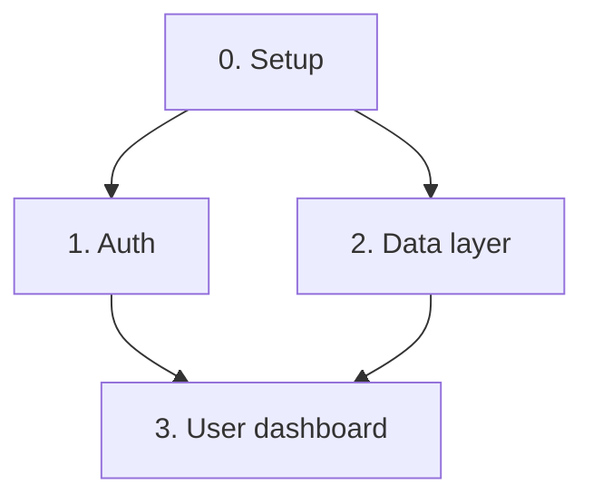

# Phase 2 - Architecture and design

**Goal:** Produce `architecture.md`, and `design.md` when the project has a user
interface.

Use `templates/architecture.md` and, conditionally, `templates/design.md`.

**Load `references/asking.md`.** The stack is a *choose* question the user owns.

---

## Tech stack

**Ask about stack preferences before choosing.** The user carries the team's
skills, hosting, and constraints; the architecture should not invent a stack they
cannot run. Ask:

> "Stack: Next.js, Django, or something else?" (choose) — or, if a reference file
> already decides it, "I took the stack from <reference> — confirm?"

Record the answer and its reasoning in `decisions.md` before writing
`architecture.md`. If the user has no preference, record that too and propose one
with a one-line justification each — then confirm the proposal in the checkpoint.

List every technology with a pinned major version: "Next.js 15.x", not "Next.js".

An unpinned stack means each nanotask is implemented against whatever the
implementing agent remembers, and two nanotasks can end up written against two
different major versions of the same library.

For Extension and Rewrite modes, the stack is mostly inherited. Record what is
inherited and what is new, separately. Every new dependency needs a one-line
justification - a dependency added without a stated reason cannot be removed
later, because nobody knows what it was for.

---

## Data model

Define every entity and every relationship now, before any nanotask exists.

A data model discovered halfway through implementation forces a rewrite of every
nanotask that touched the old shape. This is the single most expensive category
of rework in the whole workflow, and it is entirely avoidable here.

For each entity record: key fields, relationships, and a storage hint (table,
document, cache, blob).

---

## Components and dependency graph

Break the system into components, ordered so that dependencies come first.
Component 0 is always project setup.

Render the dependency graph as Mermaid:



This graph is what Phase 3 uses to order nanotasks. If the graph has a cycle, the
decomposition is wrong - break the cycle here, not in Phase 3.

---

## Risk chains

A risk chain is a cascading failure: which failure in which component breaks what
else downstream.

Record each as: trigger, immediate failure, downstream effect, mitigation.

> **Auth token refresh fails silently** -> session appears valid but every API
> call returns 401 -> the dashboard renders empty rather than erroring -> the user
> reports "my data disappeared".
> **Mitigation:** treat 401 as a distinct state from empty in the data layer.

Single-component failures are not risk chains. Only record failures that cross a
component boundary, because those are the ones no single nanotask will catch.

---

## Design document - every mode

Produce `design.md` for every project mode. A product with no documented design
is a product whose interface is whatever the implementing agent happened to
imagine first. The shape of the document follows the mode, but the file always
exists.

| Mode | `design.md` describes |
|---|---|
| `web-app` / `mobile` | Design system: tokens, components, states, screens |
| `cli-tool` | Command surface, output streams, color, help layout, prompts, TUI layout |
| `data-pipeline` / `ml-service` | Output contract: log shape, metrics, result format, error shape, dashboards |

Set `design_doc` in `meta/progress.json` to match, in both directions. Consumers
branch on that field, never on whether `design.md` happens to exist on disk - a
file whose presence is the signal forces every reader to probe the filesystem
before it can decide what to do.

### Ask design preferences first

Before writing, ask the design preferences as one numbered message, following
`references/asking.md`. Do not invent a design direction the user has to reject.

**Universal (every mode):**

| # | Question | A usable answer |
|---|---|---|
| 1 | **Mood / aesthetic direction** | "Calm and technical" or "playful and friendly" - not "nice" |
| 2 | **Reference products** | 1-3 named products whose style is admired, and what is liked about each |
| 3 | **Anti-patterns** | What it must NOT look like - "avoid dashboard clutter", "not enterprisey grey" |
| 4 | **Theme** | light / dark / both |
| 5 | **Brand color** | A hex or a named system; "none, pick sensibly" is acceptable |
| 6 | **Information density** | Dense (power users) or spacious (occasional users) |

**Mode-specific:**

| Mode | Extra question |
|---|---|
| `web-app` / `mobile` | Responsive floor: which viewport must work first? |
| `cli-tool` | Interactivity level: batch / interactive prompts / full TUI? Keyboard conventions for TUI? |
| `data-pipeline` | Who reads the output - a human operator, a dashboard, or another system? |
| `ml-service` | What consumes the result, and what does a wrong result look like? |

A question already answered by a reference file is confirmed, not re-asked. Record
all answers in `decisions.md`.

### Design system research (web-app and mobile only)

Search for a design system that matches the product's mood and the Phase 0 user.
[awesome-design-md](https://github.com/voltagent/awesome-design-md) is a useful
starting catalog. Select one that fits, then record its tokens - palette,
typography, spacing scale, elevation - in `design.md`.

Choose based on the user, not on taste. A design system built for consumer social
apps is the wrong choice for a tool a compliance officer uses for six hours a day.

If WebSearch is unavailable, define the tokens directly and record that no
external system was referenced.

### ASCII wireframes - one per core interface

End every design document with **one ASCII wireframe per core interface**, 60-80
columns wide, drawn with box-drawing characters, in a fenced code block. A core
interface is:

- `web-app` / `mobile` — each primary screen.
- `cli-tool` — each command's output and help layout; the TUI screen if the tool
  is interactive.
- `data-pipeline` / `ml-service` — the log/metrics dashboard or config surface if
  one exists; otherwise the result shape as an annotated example.

Each wireframe labels its regions and carries interaction notes beneath it. The
wireframe is the interface made visible; without one, the implementing agent
rebuilds the layout from prose, and two nanotasks can end up with two different
layouts.

---

## Write

Write `architecture.md` using `templates/architecture.md`, and `design.md` using
`templates/design.md`. Record the stack choice and every design preference answer
in `meta/decisions.md`.

## Record

Update `meta/progress.json` (set `design_doc` to the mode's design shape:
`design-system`, `cli-surface`, or `output-contract`) and append to
`meta/execution-log.md`.

## Checkpoint

Print this block, then stop. Do not continue until the user replies `APPROVED`.

```
PHASE 2 COMPLETE - Architecture and design written to <project>_plan/

  Entities:      <count>
  Components:    <count>
  Risk chains:   <count>
  Stack:         <the chosen stack, confirmed by user>
  Design mode:   <design.md shape for this mode>
  Wireframes:    <count> ASCII wireframe(s)

Review the file(s), then reply APPROVED to continue to
Phase 3 (Decomposition).
```
