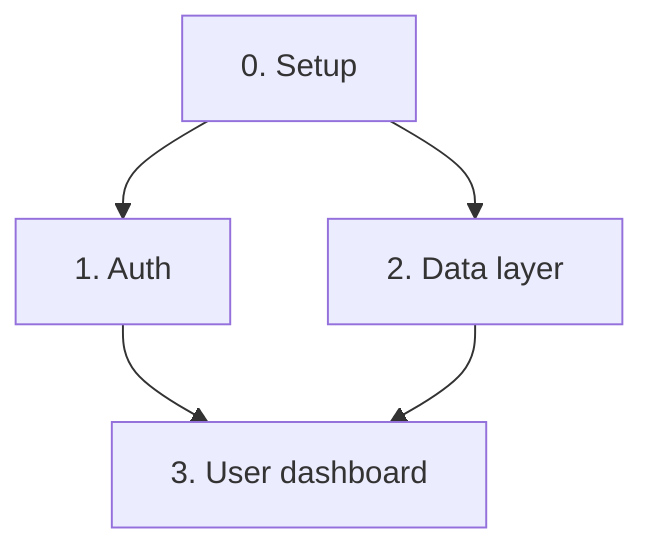

# Phase 2 - Architecture and design

**Goal:** Produce `architecture.md`, and `design.md` when the project has a user
interface.

Use `templates/architecture.md` and, conditionally, `templates/design.md`.

---

## Tech stack

List every technology with a pinned major version: "Next.js 15.x", not "Next.js".

An unpinned stack means each nanotask is implemented against whatever the
implementing agent remembers, and two nanotasks can end up written against two
different major versions of the same library.

For Extension and Rewrite modes, the stack is mostly inherited. Record what is
inherited and what is new, separately. Every new dependency needs a one-line
justification - a dependency added without a stated reason cannot be removed
later, because nobody knows what it was for.

---

## Data model

Define every entity and every relationship now, before any nanotask exists.

A data model discovered halfway through implementation forces a rewrite of every
nanotask that touched the old shape. This is the single most expensive category
of rework in the whole workflow, and it is entirely avoidable here.

For each entity record: key fields, relationships, and a storage hint (table,
document, cache, blob).

---

## Components and dependency graph

Break the system into components, ordered so that dependencies come first.
Component 0 is always project setup.

Render the dependency graph as Mermaid:

This graph is what Phase 3 uses to order nanotasks. If the graph has a cycle, the
decomposition is wrong - break the cycle here, not in Phase 3.

---

## Risk chains

A risk chain is a cascading failure: which failure in which component breaks what
else downstream.

Record each as: trigger, immediate failure, downstream effect, mitigation.

> **Auth token refresh fails silently** -> session appears valid but every API
> call returns 401 -> the dashboard renders empty rather than erroring -> the user
> reports "my data disappeared".
> **Mitigation:** treat 401 as a distinct state from empty in the data layer.

Single-component failures are not risk chains. Only record failures that cross a
component boundary, because those are the ones no single nanotask will catch.

---

## Design document - conditional

Produce `design.md` **only** when the project mode is `web-app` or `mobile`.

For `cli-tool`, `data-pipeline`, and `ml-service`: skip this section entirely,
skip the design-system search, and state in the Phase 2 checkpoint that the
design document was skipped because the mode has no user interface.

Set `design_doc` in `meta/progress.json` to match, in both directions. Consumers
branch on that field, never on whether `design.md` happens to exist on disk - a
file whose presence is the signal forces every reader to probe the filesystem
before it can decide what to do.

A design document written for a headless service is a file that every later agent
must read and none can use. It is not free - it costs context on every subsequent
turn.

### Design system research (UI modes only)

Search for a design system that matches the product's mood and the Phase 0 user.
[awesome-design-md](https://github.com/voltagent/awesome-design-md) is a useful
starting catalog. Select one that fits, then record its tokens - palette,
typography, spacing scale, elevation - in `design.md`.

Choose based on the user, not on taste. A design system built for consumer social
apps is the wrong choice for a tool a compliance officer uses for six hours a day.

If WebSearch is unavailable, define the tokens directly and record that no
external system was referenced.

---

## Checkpoint

Architecture, and the design document where one was produced, must be reviewed and
approved by the user before Phase 3 begins.
